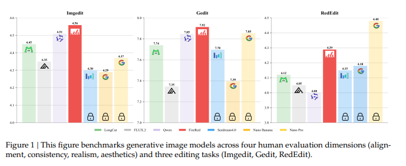

# FireRed-Image-Edit-1.0 Techinical Report

**地址**：[https://arxiv.org/abs/2602.13344](https://arxiv.org/abs/2602.13344)

**简介**：小红书图像编辑模型1.0，基于QwenImageEditPlus进行迭代训练，核心工作在于：

1. 数据的收集与清洗，共收集1.6B文生图和图生图数据，经过清洗后剩余1E（0.1B）
2. 全生命周期的Bags of training tricks，涵盖了从预训练到有监督训练再到强化学习的全流程， 进一步提升模型训练过程中的数据效率与训练稳定性。
3. 推出了一个全新的图像编辑评测benchmark REDEdit-Bench，总共包含了15大类图像编辑任务，其中也提出了美化与底层增强两类新任务。

**当前图像编辑演进的核心卡点**：

1. 黑盒类的不开源，没法研究
2. 开源的模型都越来越大，不利于训练和部署
3. 大家都倾向于去蒸馏黑盒模型，但缺少原生的高质量训练数据集与评测benchmark

**本文的提出重点解决的问题、做出的贡献**：

1. 庞大的训练数据集，囊括了一亿图文数据，包含文生图与图生图，两类数据比例1:1
    
    
    
2. 训练Tricks：
    1. 在大量训练数据的基础上提出了一套效率很高的训练方案 Multi-Condition Aware Bucket Sampler，尽可能减少了因为padding带来的训练资源浪费；
    2. 提出了一套Stochastic Instruction Alignment
    mechanism，在训练过程中对参考图进行droptout处理、对指令进行顺序打乱操作等增强模型训练泛化性；
    3. 提出一种分布式分层时间采样，将扩散过程的不同时间段打散到不同GPU上，通过同步轮换机制防止单元过拟合的同时也提升整体噪音的一致性
    4. **对数正态损失加权**将梯度贡献集中在**语义关键的中间扩散时间步**上，同时抑制可忽略的极端值。
    5. **基于指数移动平均的模型权重平均**对优化轨迹中的参数进行融合，抵消瞬时波动，从而提升模型对真实场景分布偏移的鲁棒性。
3. 针对benchmark分数与实际体验之间的体感不一致问题，作者面向用户实际体验提出了一个全面综合的测试benchmark **REDEdit-Bench**，用于更好得评估模型在实际使用过程中的好坏与否

**论文各部分具体的细节**：

1. **数据**
    1. **数据预清洗步骤**：
        
        对于真实世界数据，采用以下数据清洗流程进行大规模数据清洗：
        
        全局粗去重 → 图像指标筛选（明亮度、锐化程度等） → 内容维度清洗（水印、文本覆盖等）→ 感知分清洗（美学感知分数、艺术分）
        
        作者特意强调去掉了AIGC生成图，保证此类数据中的真实样本占比
        
    2. **数据生成pipline**：
        
        自然生成数据无法覆盖各类图像编辑特定情况，因为对于I2I，多采用数据生成方案，有以下几种方案：
        
        - **专家指令库**与**编辑目标词典:**
            - 专家指令库将模型约束与触发条件归纳为**规范原语**与**结构化槽位**，以提升指令的稳定性与性能。
            - 编辑目标词典则定义了可编辑的内容：它结合**VLM 探测**来解析图像并提出**有依据的编辑目标**；以**任务清单**作为与任务对齐的可编辑对象 / 属性库，实现长尾覆盖；并利用**辅助元数据**（如 OCR、坐标信息）作为可计算锚点，实现精确的定位与 grounding。
        - 结构化控制下的专家模型合成:
            - 从 SAM 、DWpose 等辅助感知模块中提取**结构先验**，包括分割掩码与姿态关键点，并将其与预设配置模板中的任务参数相结合，得到**面向特定任务的结构化控制信息**。
            - 这种结构化控制方法在**空间敏感型任务**中尤为有效，例如**精确目标移除、面部表情与人体姿态迁移、外观重定向**等。
        - 无模型、基于模板的合成流程：
            - **3D 参数化模板**：借助图形引擎与骨骼绑定系统，合成像素一致的面部表情、人体姿态调整及其他参数化变换；
            - **结构化布局模板**：为文字、Logo、UI 元素等图形组件定义空间锚点，严格约束排版与布局规范；
            - **算法滤波模板**：覆盖各类确定性图像信号处理操作，如锐化、色彩重定向及其他底层视觉增强。
    3. **长尾数据增补**
        
        对于长尾数据，主要的处理方案是 check and fill。首先在数据库内对现有数据做聚类，对于一些小众类目，基于文搜图、图搜图的方案从全量数据集中检索到相关的数据并进行处理。
        
    4. **数据打标：**
        
        基于VLM进行三级打标：详细指令打标→ 精确指令优化 → 用户指令生成三阶段
        
        
        
        通过将这些改写后的简洁指令与原始精细描述混合训练，构建了**覆盖从极简口语到精细指定全区间**的多尺度数据分布。这种混合策略使从长文本中学到的**细粒度视觉推理能力**能够有效泛化到短文本场景中。因此，即便面对**模糊或简洁的用户指令**，模型仍可依托深度视觉知识进行精准推理与执行。
        
    5. **数据后清洗**：
        
        数据收集、生成完成后，需要对数据进行后处理以形成训练数据集，主要有以下几个环节：
        
        - **难负样本挖掘与多维度打标：**
            
            先从海量原始数据集中采样**5 万条 “源图像–编辑指令–目标图像” 三元组**作为正样本；随后利用大语言模型对原始指令进行**语义扰动与随机改写**，生成偏离性指令，从而构建**5 万条负样本**，最终得到包含 10 万个样本的均衡数据集。为构建权威基准，我们组织专业人类标注人员进行**双盲标注**，评估标准聚焦两大核心指标：
            
            - **指令对齐度**：评估编辑结果是否准确执行文本指令
            - **感知质量**：检查清晰度、伪影与视觉美观度
            
            这套严格的标注方案保证了均衡的语义分布，为后续评估模型的精度提供了可靠基础。
            
        - **视觉语言评估模型训练：**
            
            为实现与人类审美和逻辑判断高度一致的自动化评估机制，以 **Qwen3‑VL‑8B** 为骨干网络进行微调。通过在上述 10 万条高质量标注数据上进行**监督微调（SFT）**，模型获得了解析复杂编辑指令与感知细微视觉差异的能力。
            
        - **训练视觉语言验证模型：**
            
            借助训练好的评估模型，对**超亿级规模**的原始训练数据进行全面质量评估，并设定严格过滤阈值，从**指令对齐分数**与**视觉质量分数**两个维度进行联合筛选。
            
            具体而言，模型自动识别并剔除未遵循指令、发生语义偏移或视觉保真度低（如模糊、伪影、逻辑不一致）的样本。这套系统化的数据净化流程显著优化了训练集分布，确保生成模型在后续大规模训练中专注于**高质量、高保真的编辑样本对**，从根本上提升最终模型性能。
            
2. 训练Tricks
    1. 整体训练PipeLine与训练数据量：
        
        
        
        | 阶段属性 | 预训练（Pretrain） | 持续预训练（CT） | 有监督微调（SFT） | 直接偏好优化（DPO） | 微调优化（NFT） |
        | --- | --- | --- | --- | --- | --- |
        | **数据集** |  |  |  |  |  |
        | 互联网采集数据 | 1 亿 | 500 万 | 5 万 | 1 万 | 1 万 |
        | 合成数据 | 500 万 | 1000 万 | 5 万 | 5 万 | 1 万 |
        | **标注类型** |  |  |  |  |  |
        | 原始标注（Original Cap.） | 55% | 20% | 10% | 10% | 10% |
        | 结构化标注（Structured Cap.） | 40% | 60% | 45% | 30% | 30% |
        | 指令式标注（Instructive Cap.） | 5% | 20% | 45% | 60% | 60% |
        | **训练方案** |  |  |  |  |  |
        | 分辨率（像素） | 384-512 | 512-1024 | 1024 | 1024 | 1024 |
        | 训练步数 | 30 万 | 6.5 万 | 5 千 | 5 千 | 500 |
        | 预热步数 | 0 | 0 | 500 | 500 | 0 |
        | 优化器 | 全阶段均为 AdamW（β₁=0.9，β₂=0.999） |  |  |  |  |
        | 梯度裁剪 | 全阶段均为 1 |  |  |  |  |
        | 权重衰减 | 全阶段均为 0.01 |  |  |  |  |
        - 整个流水线的核心目标是**高效处理多分辨率多模态输入，生成高保真的图像，同时提升模型对文本提示的鲁棒性**；
        - 关键创新点在于：① 分桶采样适配多分辨率；② 文本提示的随机增强；③ 基于 RoI 的一致性损失保证生成保真度；
        - 技术栈核心：VAE（视觉编码）+ Transformer（MMDiT）+ 多模态大模型（Qwen VL）+ 对比损失（RoI 级）。
    2. 预训练流程
        
        
        
        | 核心策略 | 解决的核心问题 | 关键创新点 | 最终收益 |
        | --- | --- | --- | --- |
        | 任意分辨率适配框架 | 固定分辨率导致的构图破坏、算力浪费 | 动态分桶采样（按长宽比分组）+ 双输入模式切换 | 保语义 + 提效率 + 算力利用率最大化 |
        | 大规模混合条件数据 | 网络数据噪声多、长尾概念易丢失 | 包容性过滤（不弃稀有概念）+ 原始 / 合成混合标注 | 知识覆盖广 + 提示词遵循能力强 |
        | 渐进式时间步课程学习 | 海量低质数据训练易发散、细节学习不充分 | 先高噪声（学全局）→后均匀采样（学细节）的渐进式策略 | 训练稳定 + 从粗到细掌握视觉特征 |
    3. 持续预训练流程
        
        
        
        | 策略名称 | 解决的核心问题 | 具体实现方式 | 核心收益 |
        | --- | --- | --- | --- |
        | 统一任务采样 | 模型对不同生成范式（文本 / 单图 / 多图）适配性差 | 平衡三类任务输入占比，联合训练 | 提升模型通用性，充分利用算力 |
        | 扩展分辨率 / 长宽比适配 | 模型过拟合标准分辨率，非标准画布生成质量差 | 分桶采样覆盖 9 种长宽比，分辨率提升至 512-1024 | 保构图完整性，适配任意画布尺寸 |
        | 合成数据 + 密集语义对齐 | 长尾概念覆盖不足、视觉 - 文本对齐精度低 | 补充合成数据覆盖小众领域；用密集标注替代稀疏标注，强化细粒度语义对齐 | 掌握稀有物体 / 纹理，提升提示词遵循能力 |
        | 聚类 - based 分布平衡 | 数据分布失衡导致模式坍缩、主导类别过拟合 | 按语义聚类后均匀采样，而非按原始频率采样 | 生成能力跨类别一致，避免模式坍缩 |
    4. 监督训练流程
        
        
        
        | 策略名称 | 解决的核心问题 | 具体实现方式 | 核心收益 |
        | --- | --- | --- | --- |
        | 高保真数据对齐 + 分布平衡 | 1. 预训练噪声导致生成质量低；2. 指令遵循能力弱；3. 微调时长尾概念遗忘 | 1. 人工筛选 1024×1024 高分辨率数据；2. 用指令式标注 / 结构化提示词强制文本 - 视觉精准对齐；3. 动态重采样平衡类别，避免长尾遗忘 | 1. 提升生成保真度（减少伪影）；2. 强化指令遵循；3. 保留语义多样性 |
        | 低学习率 + EMA 权重平均 | 1. 大学习率破坏预训练的全局结构；2. 单 checkpoint 偏差大、生成不稳定 | 1. 低学习率仅优化细节，不改动全局结构；2. EMA 维护参数移动平均，平滑优化过程 | 1. 提升高频细节 / 真实感；2. 增强生成稳定性；3. 降低单 checkpoint 偏差 |
    5. 强化学习训练
        
        
        
        - **DPO+PSR**解决标准 DPO “正负一起退化”，**强化正样本梯度**，不被负样本带偏。
        - **Mix-Policy**从多个专家模型取正样本，自动构造偏好对，不人工标注。
        - **Diffusion NFT**扩散模型上直接在线 RL，用**连续软奖励**，不用配对数据。
        - **LA-OCR 奖励**字符级位置 + 尺度约束，**防奖励作弊、防文字崩坏**。
        - **半困难样本挖掘**只练 “差一点就完美” 的样本，**数据效率极高**。
    6. 一致性损失
    
    | 核心问题 | 根本原因 | 解决方案核心 |
    | --- | --- | --- |
    | 身份漂移（identity drift） | 均方损失仅关注像素保真，忽略高层语义 | 引入基于人脸识别网络的身份损失 Lid |
    | 身份约束与细节合成冲突 | 低噪声阶段强行约束身份会破坏纹理 | 动态权重调度：高噪声阶段强约束，低噪声阶段无约束 |
    | 多主体身份保真实现 | 单主体策略无法适配多人场景 | 人脸独立对齐 + 多主体余弦距离平均 |
    
    g. 训练策略
    
    - **分布式分层时间步采样**将总时间步按 GPU 数量均分并动态轮换，保证全局批次均匀覆盖全噪声区间，解决分布式训练中的采样偏置问题，提升收敛稳定性。
    - **Logit‑Normal 损失加权**以扩散中间阶段为核心分配梯度权重，弱化高 / 低噪声端的无效贡献，让模型重点学习语义结构与纹理形成的关键阶段。
    - **模型权重平均（EMA）**对收敛阶段的参数做指数移动平均，平滑优化过程、消除瞬时波动，增强模型在真实场景编辑中的鲁棒性与泛化能力。
3. Benchmark：
    1. benchmark构成 
    
    
    
    - 构建了**1,673 对中英双语**图像编辑评测集，覆盖 **15 类结构化编辑任务**。
    - 数据经过**专业筛选 + 专家审核**，来源合法、指令多样、类别分布均衡。
    - 在规模、真实图像、人工过滤、细分子任务、双语、专用评测提示六个维度上**全面超越现有开源基准**。

b. 测试流程

- 从三大维度综合评估：**指令遵循度、视觉自然度、物理与细节一致性**。
- 使用 **Gemini 3 Flash** 作为自动化评测器，实现客观、统一打分。
- 针对**文字编辑任务**提出两套新指标：
    - **OCR 指标**：计算编辑距离、完成率、字符准确率，量化文字生成精度。
    - **VLM Judge**：从编辑成功度、过度编辑、风格、背景融合一致性评价视觉质量。

c. 整体评测框架

- 采用**人工评测 + 基准量化评测**双验证体系。
- 评测覆盖四大类任务：通用编辑、文字中心编辑、创意编辑、虚拟试穿编辑。

d. 人工评测设计

- 采用**盲评、多模型同屏随机展示**，消除位置与品牌偏好，保证公平。
- 从两个核心维度打分：
    1. **Prompt Following（指令遵循）**：是否准确理解并完整执行编辑意图。
    2. **Consistency Preservation（一致性保持）**：是否只改指定区域，**保留身份、背景、结构、布局**等非编辑区域不变。